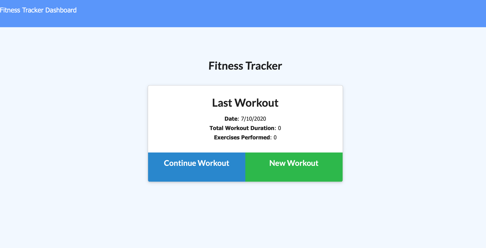

# Fitness Tracker

## Description

The Fitness Tracker allows you to view create and track daily workouts.

## Table of Contents

* [Usage](#usage)

* [Technology](#Technology)

* [Questions](#questions)

## Usage
https://immense-waters-20745.herokuapp.com

create and track your daily workouts and also log multiple exercises in a workout on a given day. The app makes it easy to track the name, type, weight, sets, reps, and duration of each exercise. Additionally, the app helps to track the distance traveledfor cardio workouts.

## Technology

JavaScript, Express, Mongo, Mongoose, Node.js, CSS, HTML

## Questions

Mónica Polanco Fabián | MonicaPolancoFabian15@gmail.com
